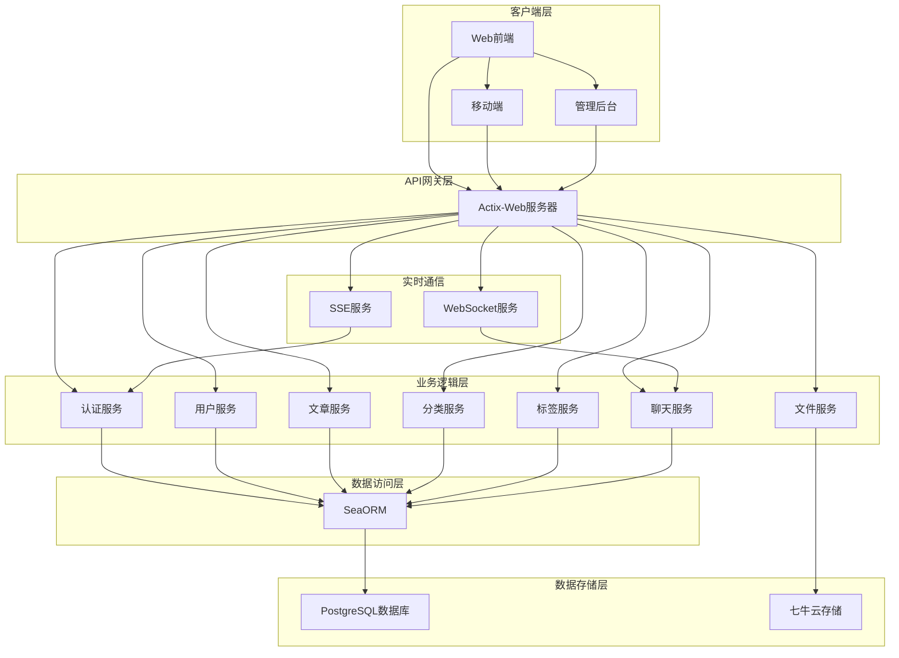
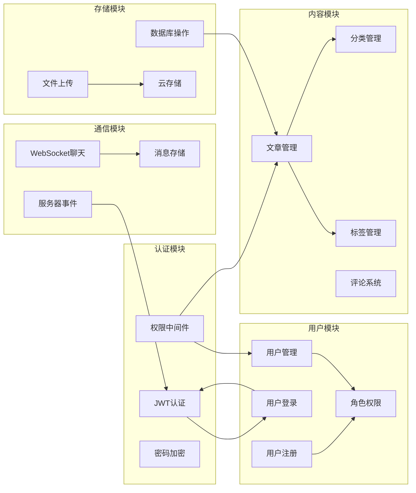
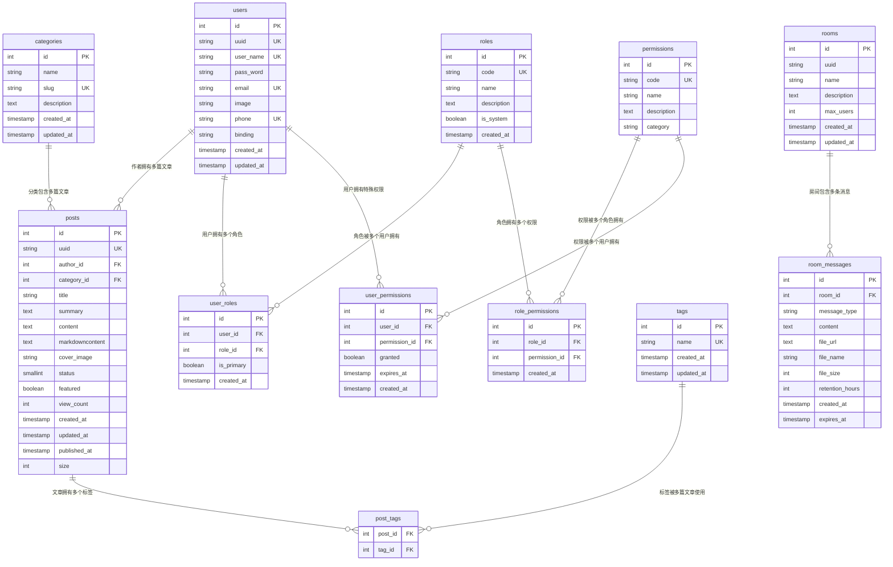

# 博客系统架构图

## 系统整体架构



## 核心模块关系图



## 数据库设计图



## API架构图

```mermaid
graph TB
    subgraph "API网关"
        A[Actix-Web路由]
    end

    subgraph "认证API"
        B1[/api/v1/auth/register]
        B2[/api/v1/auth/login]
        B3[/api/v1/auth/email]
        B4[/api/v1/auth/phone]
        B5[/api/v1/auth/oauth]
    end

    subgraph "用户API"
        C1[/api/v1/users]
        C2[/api/v1/users/{uuid}]
    end

    subgraph "内容API"
        D1[/api/v1/posts]
        D2[/api/v1/posts/{uuid}]
        D3[/api/v1/categories]
        D4[/api/v1/categories/{id}]
        D5[/api/v1/tags]
        D6[/api/v1/tags/{id}]
    end

    subgraph "实时通信API"
        E1[/api/v1/ws]
        E2[/api/v1/sse/stream]
        E3[/api/v1/rooms]
        E4[/api/v1/rooms/{room_id}]
        E5[/api/v1/rooms/{room_id}/messages]
    end

    subgraph "文件API"
        F1[/api/v1/upload]
    end

    A --> B1
    A --> B2
    A --> B3
    A --> B4
    A --> B5
    A --> C1
    A --> C2
    A --> D1
    A --> D2
    A --> D3
    A --> D4
    A --> D5
    A --> D6
    A --> E1
    A --> E2
    A --> E3
    A --> E4
    A --> E5
    A --> F1
```
