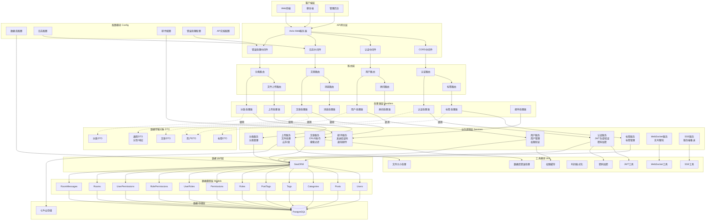
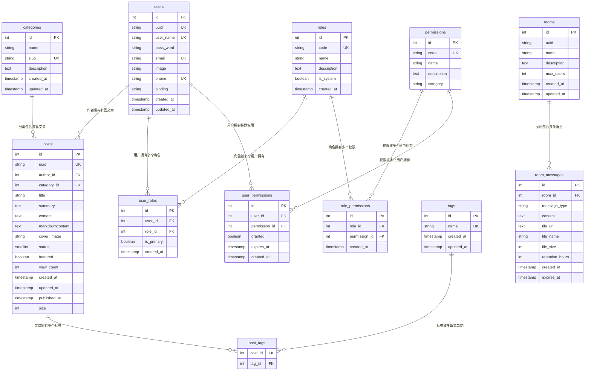
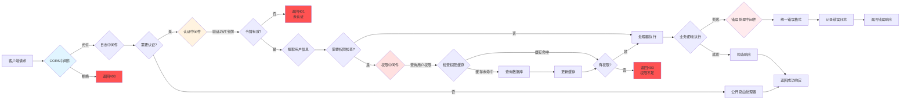
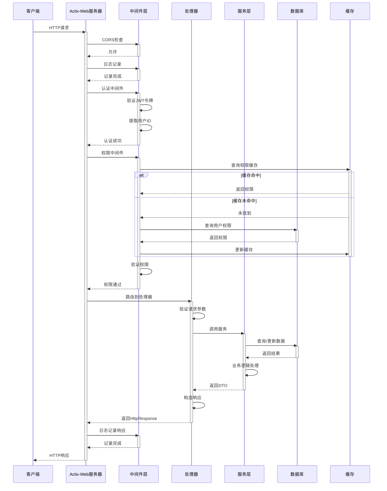
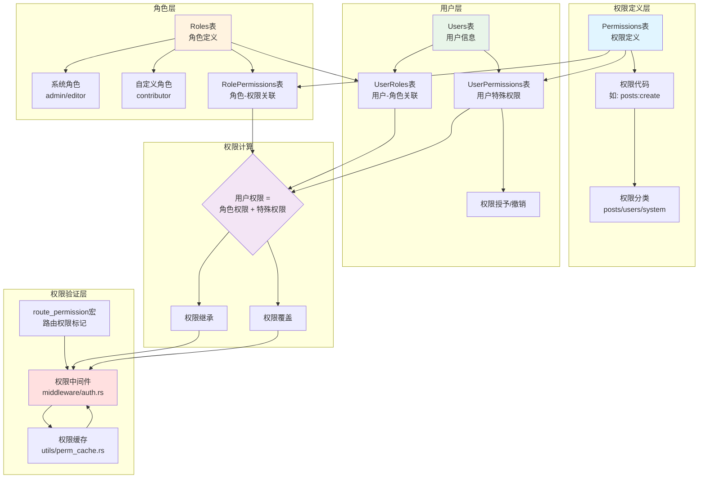
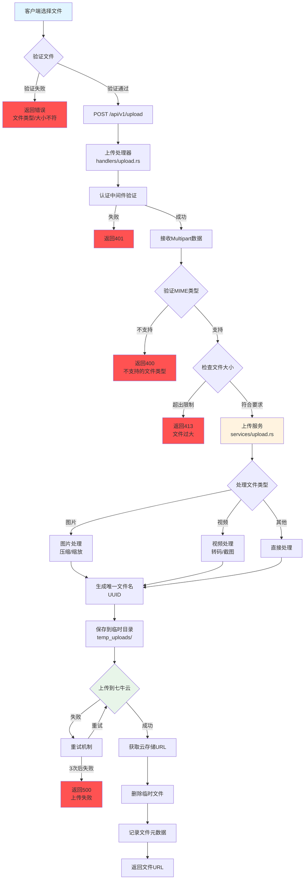
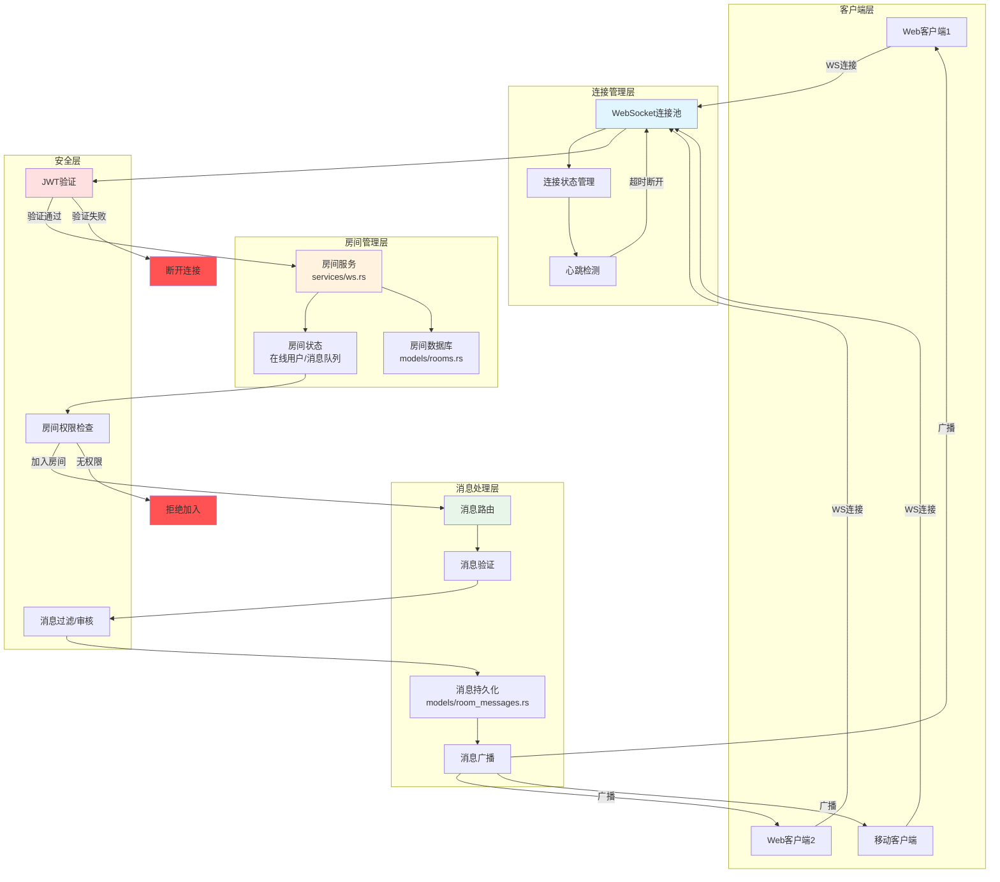
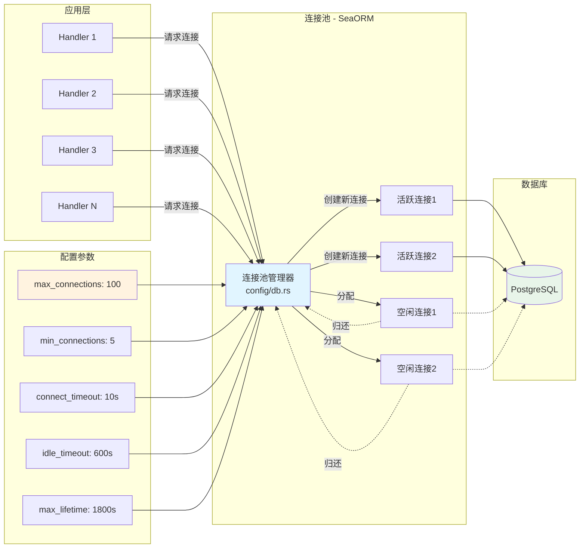

# 博客系统架构图

## 系统整体架构

```mermaid
graph TB
    subgraph "客户端层"
        A[Web前端]
        B[移动端]
        C[管理后台]
    end

    subgraph "API网关层"
        D[Actix-Web服务器]
        D1[CORS中间件]
        D2[认证中间件]
        D3[日志中间件]
        D4[错误处理中间件]
    end

    subgraph "路由层"
        R1[认证路由]
        R2[用户路由]
        R3[文章路由]
        R4[分类路由]
        R5[标签路由]
        R6[房间路由]
        R7[消息路由]
        R8[文件上传路由]
    end

    subgraph "处理器层 Handlers"
        H1[认证处理器]
        H2[用户处理器]
        H3[文章处理器]
        H4[分类处理器]
        H5[标签处理器]
        H6[房间处理器]
        H7[消息处理器]
        H8[上传处理器]
        H9[邮件处理器]
    end

    subgraph "业务逻辑层 Services"
        S1[认证服务<br/>JWT生成/验证<br/>密码加密]
        S2[用户服务<br/>用户管理<br/>权限验证]
        S3[文章服务<br/>CRUD操作<br/>搜索过滤]
        S4[分类服务<br/>分类管理]
        S5[标签服务<br/>标签管理]
        S6[邮件服务<br/>发送验证码<br/>通知邮件]
        S7[上传服务<br/>文件处理<br/>云存储]
        S8[WebSocket服务<br/>实时聊天]
        S9[SSE服务<br/>服务端推送]
    end

    subgraph "数据传输对象 DTO"
        DTO1[用户DTO]
        DTO2[文章DTO]
        DTO3[分类DTO]
        DTO4[标签DTO]
        DTO5[通用DTO<br/>分页/响应]
    end

    subgraph "数据模型层 Models"
        M1[Users]
        M2[Posts]
        M3[Categories]
        M4[Tags]
        M5[PostTags]
        M6[Roles]
        M7[Permissions]
        M8[UserRoles]
        M9[RolePermissions]
        M10[UserPermissions]
        M11[Rooms]
        M12[RoomMessages]
    end

    subgraph "工具模块 Utils"
        U1[JWT工具]
        U2[密码加密]
        U3[数据库错误处理]
        U4[时间格式化]
        U5[文件大小处理]
        U6[权限缓存]
        U7[WebSocket工具]
        U8[SSE工具]
    end

    subgraph "配置模块 Config"
        C1[数据库配置]
        C2[日志配置]
        C3[邮件配置]
        C4[错误处理配置]
        C5[API文档配置]
    end

    subgraph "数据访问层"
        ORM[SeaORM]
    end

    subgraph "数据存储层"
        DB[(PostgreSQL)]
        CLOUD[七牛云存储]
    end

    A --> D
    B --> D
    C --> D

    D --> D1
    D --> D2
    D --> D3
    D --> D4

    D1 --> R1
    D2 --> R2
    D3 --> R3
    D4 --> R4
    R1 --> R5
    R2 --> R6
    R3 --> R7
    R4 --> R8

    R1 --> H1
    R2 --> H2
    R3 --> H3
    R4 --> H4
    R5 --> H5
    R6 --> H6
    R7 --> H7
    R8 --> H8

    H1 --> S1
    H2 --> S2
    H3 --> S3
    H4 --> S4
    H5 --> S5
    H8 --> S7
    H9 --> S6

    H1 -.使用.-> DTO1
    H2 -.使用.-> DTO1
    H3 -.使用.-> DTO2
    H4 -.使用.-> DTO3
    H5 -.使用.-> DTO4
    H3 -.使用.-> DTO5

    S1 --> U1
    S1 --> U2
    S2 --> U6
    S3 --> U3
    S7 --> U5
    S8 --> U7
    S9 --> U8

    S1 --> ORM
    S2 --> ORM
    S3 --> ORM
    S4 --> ORM
    S5 --> ORM
    S7 --> CLOUD

    ORM --> M1
    ORM --> M2
    ORM --> M3
    ORM --> M4
    ORM --> M5
    ORM --> M6
    ORM --> M7
    ORM --> M8
    ORM --> M9
    ORM --> M10
    ORM --> M11
    ORM --> M12

    M1 --> DB
    M2 --> DB
    M3 --> DB
    M4 --> DB
    M5 --> DB
    M6 --> DB
    M7 --> DB
    M8 --> DB
    M9 --> DB
    M10 --> DB
    M11 --> DB
    M12 --> DB

    C1 --> ORM
    C2 --> D3
    C3 --> S6
    C4 --> D4
```

## 核心模块关系图

```mermaid
graph TB
    subgraph "认证授权模块"
        A1[JWT生成/验证<br/>utils/jwt.rs]
        A2[密码加密<br/>utils/crypto_pwd.rs]
        A3[认证中间件<br/>middleware/auth.rs]
        A4[权限缓存<br/>utils/perm_cache.rs]
        A5[认证服务<br/>services/auth.rs]
    end

    subgraph "用户管理模块"
        B1[用户处理器<br/>handlers/users.rs]
        B2[用户服务<br/>services/users.rs]
        B3[用户模型<br/>models/users.rs]
        B4[角色模型<br/>models/roles.rs]
        B5[权限模型<br/>models/permissions.rs]
        B6[用户角色关联<br/>models/user_roles.rs]
        B7[角色权限关联<br/>models/role_permissions.rs]
        B8[用户权限关联<br/>models/user_permissions.rs]
        B9[用户DTO<br/>dto/user.rs]
    end

    subgraph "内容管理模块"
        C1[文章处理器<br/>handlers/posts.rs]
        C2[文章服务<br/>services/posts.rs]
        C3[文章模型<br/>models/posts.rs]
        C4[分类处理器<br/>handlers/category.rs]
        C5[分类服务<br/>services/category.rs]
        C6[分类模型<br/>models/categories.rs]
        C7[标签处理器<br/>handlers/tags.rs]
        C8[标签模型<br/>models/tags.rs]
        C9[文章标签关联<br/>models/post_tags.rs]
        C10[文章DTO<br/>dto/posts.rs]
        C11[分类DTO<br/>dto/category.rs]
        C12[标签DTO<br/>dto/tag.rs]
    end

    subgraph "实时通信模块"
        D1[WebSocket服务<br/>services/ws.rs]
        D2[SSE服务<br/>services/sse.rs]
        D3[房间处理器<br/>handlers/rooms.rs]
        D4[消息处理器<br/>handlers/room_messages.rs]
        D5[房间模型<br/>models/rooms.rs]
        D6[消息模型<br/>models/room_messages.rs]
        D7[WebSocket工具<br/>utils/websocket.rs]
        D8[SSE工具<br/>utils/sse.rs]
    end

    subgraph "文件管理模块"
        E1[上传处理器<br/>handlers/upload.rs]
        E2[上传服务<br/>services/upload.rs]
        E3[文件大小工具<br/>utils/file_size.rs]
        E4[七牛云存储]
    end

    subgraph "邮件模块"
        F1[邮件处理器<br/>handlers/email.rs]
        F2[邮件服务<br/>services/email.rs]
        F3[邮件配置<br/>config/email.rs]
    end

    subgraph "配置与工具模块"
        G1[数据库配置<br/>config/db.rs]
        G2[日志配置<br/>config/log.rs]
        G3[错误处理<br/>config/error.rs]
        G4[API文档<br/>config/api_doc.rs]
        G5[时间格式化<br/>utils/fmt_time.rs]
        G6[数据处理<br/>utils/data_processing.rs]
        G7[数据库错误<br/>utils/db_error.rs]
    end

    %% 认证流程
    A3 --> A1
    A3 --> A4
    A5 --> A1
    A5 --> A2

    %% 用户管理流程
    B1 --> B2
    B1 -.DTO.-> B9
    B2 --> B3
    B2 --> B4
    B2 --> B5
    B3 --> B6
    B4 --> B7
    B5 --> B8

    %% 内容管理流程
    C1 --> C2
    C1 -.DTO.-> C10
    C2 --> C3
    C2 --> C9
    C4 --> C5
    C4 -.DTO.-> C11
    C5 --> C6
    C7 -.DTO.-> C12
    C7 --> C8
    C3 --> C9
    C3 --> C6

    %% 实时通信流程
    D3 --> D1
    D4 --> D1
    D1 --> D7
    D2 --> D8
    D1 --> D5
    D1 --> D6

    %% 文件上传流程
    E1 --> E2
    E2 --> E3
    E2 --> E4

    %% 邮件流程
    F1 --> F2
    F2 --> F3

    %% 配置依赖
    B2 --> G1
    C2 --> G1
    D1 --> G1
    E2 --> G3

    %% 认证保护
    A3 -.保护.-> C1
    A3 -.保护.-> B1
    A3 -.保护.-> E1
```

## 数据库设计图

```mermaid
erDiagram
    users ||--o{ posts : "作者拥有多篇文章"
    users ||--o{ user_roles : "用户拥有多个角色"
    roles ||--o{ user_roles : "角色被多个用户拥有"
    roles ||--o{ role_permissions : "角色拥有多个权限"
    permissions ||--o{ role_permissions : "权限被多个角色拥有"
    users ||--o{ user_permissions : "用户拥有特殊权限"
    permissions ||--o{ user_permissions : "权限被多个用户拥有"

    posts ||--o{ post_tags : "文章拥有多个标签"
    tags ||--o{ post_tags : "标签被多篇文章使用"
    categories ||--o{ posts : "分类包含多篇文章"

    rooms ||--o{ room_messages : "房间包含多条消息"

    users {
        int id PK
        string uuid UK
        string user_name UK
        string pass_word
        string email UK
        string image
        string phone UK
        string binding
        timestamp created_at
        timestamp updated_at
    }

    roles {
        int id PK
        string code UK
        string name
        text description
        boolean is_system
        timestamp created_at
    }

    permissions {
        int id PK
        string code UK
        string name
        text description
        string category
    }

    user_roles {
        int id PK
        int user_id FK
        int role_id FK
        boolean is_primary
        timestamp created_at
    }

    role_permissions {
        int id PK
        int role_id FK
        int permission_id FK
        timestamp created_at
    }

    user_permissions {
        int id PK
        int user_id FK
        int permission_id FK
        boolean granted
        timestamp expires_at
        timestamp created_at
    }

    posts {
        int id PK
        string uuid UK
        int author_id FK
        int category_id FK
        string title
        text summary
        text content
        text markdowncontent
        string cover_image
        smallint status
        boolean featured
        int view_count
        timestamp created_at
        timestamp updated_at
        timestamp published_at
        int size
    }

    categories {
        int id PK
        string name
        string slug UK
        text description
        timestamp created_at
        timestamp updated_at
    }

    tags {
        int id PK
        string name UK
        timestamp created_at
        timestamp updated_at
    }

    post_tags {
        int post_id FK
        int tag_id FK
    }

    rooms {
        int id PK
        string uuid
        string name
        text description
        int max_users
        timestamp created_at
        timestamp updated_at
    }

    room_messages {
        int id PK
        int room_id FK
        string message_type
        text content
        text file_url
        string file_name
        int file_size
        int retention_hours
        timestamp created_at
        timestamp expires_at
    }
```

## 中间件处理流程图

```mermaid
graph LR
    A[客户端请求] --> B{CORS中间件}
    B -->|允许| C{日志中间件}
    B -->|拒绝| Z1[返回403]

    C --> D{需要认证?}

    D -->|否| E[公开路由处理器]
    D -->|是| F{认证中间件}

    F -->|验证JWT令牌| G{令牌有效?}
    G -->|否| Z2[返回401<br/>未认证]
    G -->|是| H{提取用户信息}

    H --> I{需要权限检查?}
    I -->|否| J[处理器执行]
    I -->|是| K{权限中间件}

    K -->|查询用户权限| L{检查权限缓存}
    L -->|缓存命中| M{有权限?}
    L -->|缓存未命中| N[查询数据库]
    N --> O[更新缓存]
    O --> M

    M -->|是| J
    M -->|否| Z3[返回403<br/>权限不足]

    J --> P{业务逻辑执行}
    P -->|成功| Q[构造响应]
    P -->|失败| R{错误处理中间件}

    R --> S[统一错误格式]
    S --> T[记录错误日志]
    T --> U[返回错误响应]

    Q --> V[返回成功响应]
    E --> V

    style B fill:#e1f5ff
    style F fill:#fff3e0
    style K fill:#ffe0e0
    style R fill:#ffebee
    style Z1 fill:#ff5252
    style Z2 fill:#ff5252
    style Z3 fill:#ff5252
```

## 请求处理生命周期

```mermaid
sequenceDiagram
    participant C as 客户端
    participant S as Actix-Web服务器
    participant M as 中间件层
    participant H as 处理器
    participant SV as 服务层
    participant DB as 数据库
    participant Cache as 缓存

    C->>S: HTTP请求
    activate S

    S->>M: CORS检查
    activate M
    M-->>S: 允许
    deactivate M

    S->>M: 日志记录
    activate M
    M-->>S: 记录完成
    deactivate M

    S->>M: 认证中间件
    activate M
    M->>M: 验证JWT令牌
    M->>M: 提取用户ID
    M-->>S: 认证成功
    deactivate M

    S->>M: 权限中间件
    activate M
    M->>Cache: 查询权限缓存
    activate Cache

    alt 缓存命中
        Cache-->>M: 返回权限
    else 缓存未命中
        Cache-->>M: 未找到
        M->>DB: 查询用户权限
        activate DB
        DB-->>M: 返回权限
        deactivate DB
        M->>Cache: 更新缓存
    end
    deactivate Cache

    M->>M: 验证权限
    M-->>S: 权限通过
    deactivate M

    S->>H: 路由到处理器
    activate H
    H->>H: 验证请求参数
    H->>SV: 调用服务
    activate SV

    SV->>DB: 查询/更新数据
    activate DB
    DB-->>SV: 返回结果
    deactivate DB

    SV->>SV: 业务逻辑处理
    SV-->>H: 返回DTO
    deactivate SV

    H->>H: 构造响应
    H-->>S: 返回HttpResponse
    deactivate H

    S->>M: 日志记录响应
    activate M
    M-->>S: 记录完成
    deactivate M

    S-->>C: HTTP响应
    deactivate S
```

## 权限系统架构

```mermaid
graph TB
    subgraph "权限定义层"
        P1[Permissions表<br/>权限定义]
        P2[权限代码<br/>如: posts:create]
        P3[权限分类<br/>posts/users/system]
    end

    subgraph "角色层"
        R1[Roles表<br/>角色定义]
        R2[系统角色<br/>admin/editor]
        R3[自定义角色<br/>contributor]
        R4[RolePermissions表<br/>角色-权限关联]
    end

    subgraph "用户层"
        U1[Users表<br/>用户信息]
        U2[UserRoles表<br/>用户-角色关联]
        U3[UserPermissions表<br/>用户特殊权限]
        U4[权限授予/撤销]
    end

    subgraph "权限验证层"
        V1[route_permission宏<br/>路由权限标记]
        V2[权限中间件<br/>middleware/auth.rs]
        V3[权限缓存<br/>utils/perm_cache.rs]
    end

    subgraph "权限计算"
        C1{用户权限 = <br/>角色权限 + 特殊权限}
        C2[权限继承]
        C3[权限覆盖]
    end

    P1 --> P2
    P2 --> P3

    R1 --> R2
    R1 --> R3
    R1 --> R4
    P1 --> R4

    U1 --> U2
    R1 --> U2
    U1 --> U3
    P1 --> U3
    U3 --> U4

    V1 --> V2
    V2 --> V3

    U2 --> C1
    R4 --> C1
    U3 --> C1
    C1 --> C2
    C1 --> C3

    C2 --> V2
    C3 --> V2
    V3 --> V2

    style P1 fill:#e1f5ff
    style R1 fill:#fff3e0
    style U1 fill:#e8f5e9
    style V2 fill:#ffe0e0
    style C1 fill:#f3e5f5
```

## 文件上传流程

```mermaid
graph TB
    A[客户端选择文件] --> B{验证文件}
    B -->|验证失败| Z1[返回错误<br/>文件类型/大小不符]
    B -->|验证通过| C[POST /api/v1/upload]

    C --> D[上传处理器<br/>handlers/upload.rs]
    D --> E[认证中间件验证]
    E -->|失败| Z2[返回401]
    E -->|成功| F[接收Multipart数据]

    F --> G{验证MIME类型}
    G -->|不支持| Z3[返回400<br/>不支持的文件类型]
    G -->|支持| H{检查文件大小}

    H -->|超出限制| Z4[返回413<br/>文件过大]
    H -->|符合要求| I[上传服务<br/>services/upload.rs]

    I --> J{处理文件类型}
    J -->|图片| K[图片处理<br/>压缩/缩放]
    J -->|视频| L[视频处理<br/>转码/截图]
    J -->|其他| M[直接处理]

    K --> N[生成唯一文件名<br/>UUID]
    L --> N
    M --> N

    N --> O[保存到临时目录<br/>temp_uploads/]
    O --> P{上传到七牛云}

    P -->|失败| Q[重试机制]
    Q -->|3次后失败| Z5[返回500<br/>上传失败]
    Q -->|重试| P

    P -->|成功| R[获取云存储URL]
    R --> S[删除临时文件]
    S --> T[记录文件元数据]
    T --> U[返回文件URL]

    style A fill:#e1f5ff
    style I fill:#fff3e0
    style P fill:#e8f5e9
    style Z1 fill:#ff5252
    style Z2 fill:#ff5252
    style Z3 fill:#ff5252
    style Z4 fill:#ff5252
    style Z5 fill:#ff5252
```

## WebSocket聊天架构

```mermaid
graph TB
    subgraph "客户端层"
        C1[Web客户端1]
        C2[Web客户端2]
        C3[移动客户端]
    end

    subgraph "连接管理层"
        W1[WebSocket连接池]
        W2[连接状态管理]
        W3[心跳检测]
    end

    subgraph "房间管理层"
        R1[房间服务<br/>services/ws.rs]
        R2[房间状态<br/>在线用户/消息队列]
        R3[房间数据库<br/>models/rooms.rs]
    end

    subgraph "消息处理层"
        M1[消息路由]
        M2[消息验证]
        M3[消息持久化<br/>models/room_messages.rs]
        M4[消息广播]
    end

    subgraph "安全层"
        S1[JWT验证]
        S2[房间权限检查]
        S3[消息过滤/审核]
    end

    C1 -->|WS连接| W1
    C2 -->|WS连接| W1
    C3 -->|WS连接| W1

    W1 --> W2
    W2 --> W3
    W3 -->|超时断开| W1

    W1 --> S1
    S1 -->|验证通过| R1
    S1 -->|验证失败| X1[断开连接]

    R1 --> R2
    R1 --> R3
    R2 --> S2

    S2 -->|加入房间| M1
    S2 -->|无权限| X2[拒绝加入]

    M1 --> M2
    M2 --> S3
    S3 --> M3
    M3 --> M4

    M4 -->|广播| C1
    M4 -->|广播| C2
    M4 -->|广播| C3

    style W1 fill:#e1f5ff
    style R1 fill:#fff3e0
    style M1 fill:#e8f5e9
    style S1 fill:#ffe0e0
    style X1 fill:#ff5252
    style X2 fill:#ff5252
```

## 数据库连接池管理

```mermaid
graph LR
    subgraph "应用层"
        A1[Handler 1]
        A2[Handler 2]
        A3[Handler 3]
        A4[Handler N]
    end

    subgraph "连接池 - SeaORM"
        P[连接池管理器<br/>config/db.rs]
        C1[空闲连接1]
        C2[空闲连接2]
        C3[活跃连接1]
        C4[活跃连接2]
    end

    subgraph "配置参数"
        CF1[max_connections: 100]
        CF2[min_connections: 5]
        CF3[connect_timeout: 10s]
        CF4[idle_timeout: 600s]
        CF5[max_lifetime: 1800s]
    end

    subgraph "数据库"
        DB[(PostgreSQL)]
    end

    A1 -->|请求连接| P
    A2 -->|请求连接| P
    A3 -->|请求连接| P
    A4 -->|请求连接| P

    P -->|分配| C1
    P -->|分配| C2
    P -->|创建新连接| C3
    P -->|创建新连接| C4

    C1 -.归还.-> P
    C2 -.归还.-> P
    C3 --> DB
    C4 --> DB
    C1 -.-> DB
    C2 -.-> DB

    CF1 --> P
    CF2 --> P
    CF3 --> P
    CF4 --> P
    CF5 --> P

    style P fill:#e1f5ff
    style DB fill:#e8f5e9
    style CF1 fill:#fff3e0
```

## API架构图

```mermaid
graph TB
    subgraph "API网关"
        A[Actix-Web路由<br/>routes/routes_module.rs]
        A1[CORS中间件]
        A2[认证中间件]
        A3[日志中间件]
    end

    subgraph "认证授权API - /api/v1/auth"
        B1[POST /register<br/>用户注册]
        B2[POST /login<br/>用户登录]
        B3[POST /email<br/>邮箱认证]
        B4[POST /phone<br/>手机认证]
        B5[POST /oauth<br/>第三方登录]
        B6[POST /refresh<br/>刷新令牌]
        B7[POST /logout<br/>退出登录]
    end

    subgraph "用户管理API - /api/v1/users"
        C1[GET /<br/>获取用户列表]
        C2[GET /:uuid<br/>获取用户详情]
        C3[PUT /:uuid<br/>更新用户信息]
        C4[DELETE /:uuid<br/>删除用户]
        C5[GET /:uuid/posts<br/>获取用户文章]
        C6[PUT /:uuid/password<br/>修改密码]
        C7[PUT /:uuid/roles<br/>分配角色]
        C8[GET /:uuid/permissions<br/>获取用户权限]
    end

    subgraph "文章管理API - /api/v1/posts"
        D1[GET /<br/>获取文章列表<br/>支持分页/搜索/过滤]
        D2[POST /<br/>创建文章<br/>需要权限]
        D3[GET /:uuid<br/>获取文章详情]
        D4[PUT /:uuid<br/>更新文章<br/>需要权限]
        D5[DELETE /:uuid<br/>删除文章<br/>需要权限]
        D6[POST /:uuid/publish<br/>发布文章]
        D7[GET /featured<br/>获取精选文章]
        D8[GET /search<br/>全文搜索]
    end

    subgraph "分类管理API - /api/v1/categories"
        E1[GET /<br/>获取分类列表]
        E2[POST /<br/>创建分类<br/>需要权限]
        E3[GET /:id<br/>获取分类详情]
        E4[PUT /:id<br/>更新分类<br/>需要权限]
        E5[DELETE /:id<br/>删除分类<br/>需要权限]
        E6[GET /:id/posts<br/>获取分类下的文章]
    end

    subgraph "标签管理API - /api/v1/tags"
        F1[GET /<br/>获取标签列表]
        F2[POST /<br/>创建标签<br/>需要权限]
        F3[GET /:id<br/>获取标签详情]
        F4[PUT /:id<br/>更新标签<br/>需要权限]
        F5[DELETE /:id<br/>删除标签<br/>需要权限]
        F6[GET /:id/posts<br/>获取标签下的文章]
    end

    subgraph "房间管理API - /api/v1/rooms"
        G1[GET /<br/>获取房间列表]
        G2[POST /<br/>创建房间]
        G3[GET /:room_id<br/>获取房间详情]
        G4[PUT /:room_id<br/>更新房间]
        G5[DELETE /:room_id<br/>删除房间]
        G6[GET /:room_id/messages<br/>获取房间消息]
        G7[POST /:room_id/messages<br/>发送消息]
    end

    subgraph "实时通信API"
        H1[WS /api/v1/ws<br/>WebSocket连接<br/>实时聊天]
        H2[GET /api/v1/sse/stream<br/>SSE事件流<br/>服务端推送]
    end

    subgraph "文件管理API - /api/v1"
        I1[POST /upload<br/>上传文件<br/>支持图片/视频]
        I2[POST /upload/avatar<br/>上传头像]
        I3[POST /upload/cover<br/>上传封面]
    end

    subgraph "邮件API - /api/v1/email"
        J1[POST /verify<br/>发送验证邮件]
        J2[POST /reset-password<br/>发送重置密码邮件]
        J3[POST /notification<br/>发送通知邮件]
    end

    A --> A1
    A1 --> A2
    A2 --> A3

    A3 --> B1
    A3 --> B2
    A3 --> B3
    A3 --> B4
    A3 --> B5
    A3 --> B6
    A3 --> B7

    A2 -.需要认证.-> C1
    A2 -.需要认证.-> C2
    A2 -.需要认证.-> C3
    A2 -.需要认证.-> C4
    A2 -.需要认证.-> C5
    A2 -.需要认证.-> C6
    A2 -.需要认证.-> C7
    A2 -.需要认证.-> C8

    A3 --> D1
    A2 -.需要认证.-> D2
    A3 --> D3
    A2 -.需要认证.-> D4
    A2 -.需要认证.-> D5
    A2 -.需要认证.-> D6
    A3 --> D7
    A3 --> D8

    A3 --> E1
    A2 -.需要权限.-> E2
    A3 --> E3
    A2 -.需要权限.-> E4
    A2 -.需要权限.-> E5
    A3 --> E6

    A3 --> F1
    A2 -.需要权限.-> F2
    A3 --> F3
    A2 -.需要权限.-> F4
    A2 -.需要权限.-> F5
    A3 --> F6

    A2 -.需要认证.-> G1
    A2 -.需要认证.-> G2
    A2 -.需要认证.-> G3
    A2 -.需要认证.-> G4
    A2 -.需要认证.-> G5
    A2 -.需要认证.-> G6
    A2 -.需要认证.-> G7

    A2 -.需要认证.-> H1
    A2 -.需要认证.-> H2

    A2 -.需要认证.-> I1
    A2 -.需要认证.-> I2
    A2 -.需要认证.-> I3

    A3 --> J1
    A3 --> J2
    A3 --> J3

    style B1 fill:#e1f5ff
    style B2 fill:#e1f5ff
    style D2 fill:#fff3e0
    style D4 fill:#fff3e0
    style D5 fill:#fff3e0
    style E2 fill:#ffe0e0
    style E4 fill:#ffe0e0
    style E5 fill:#ffe0e0
    style F2 fill:#ffe0e0
    style F4 fill:#ffe0e0
    style F5 fill:#ffe0e0
```
